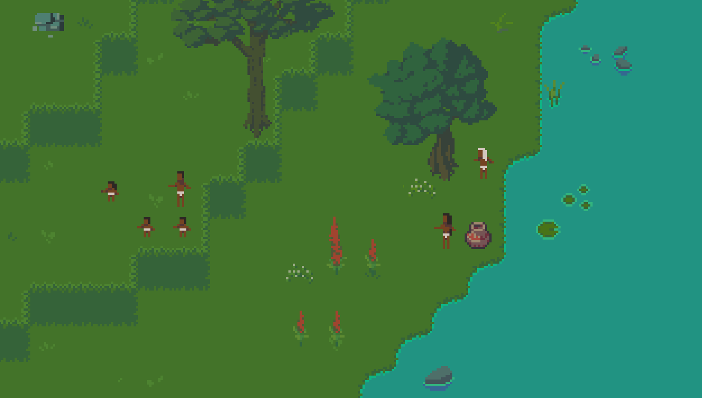

# Colonization of Ysamba

The year is 1541 and while the Spanish colonization is already underway in the American continent, some caravels have been seen for the first time in the region of Ysamba.

Colonization of Ysamba is a society simulation game where you try to survive as a Native American family in an procedurally generated island that is being colonized by Spanish conquistadores. Will you hide in the mountains and live as hunter-gatherers? Will you forge alliances with other native groups to attack the colonizers? Will you integrate with the Spanish colony and help them find gold?

# Sources

The game uses accurate historical elements of several 16th century colonial societies to procedurally generate a fictional island that simulates the surprise, pain and contradictions that flooded Native American societies in this period. The game bases itself in the following sources:

- [General History of the Things of New Spain](https://en.wikipedia.org/wiki/Florentine_Codex)
- [The Account of Alvar Nuñez Cabeza de Vaca](https://en.wikipedia.org/wiki/%C3%81lvar_N%C3%BA%C3%B1ez_Cabeza_de_Vaca#La_relaci%C3%B3n_de_%C3%81lvar_N%C3%BA%C3%B1ez_Cabeza_de_Vaca)
- [A Short Account of the Destruction of the Indies](https://en.wikipedia.org/wiki/A_Short_Account_of_the_Destruction_of_the_Indies)
